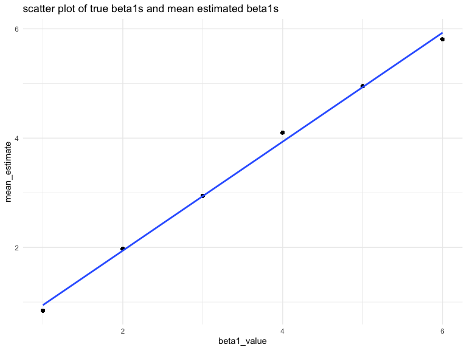
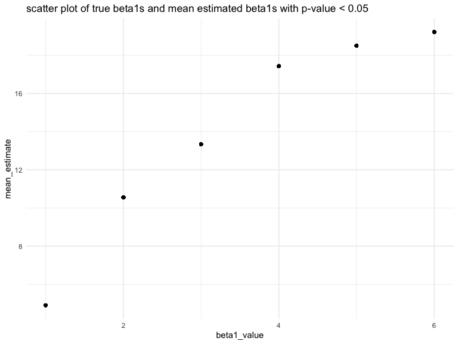

HW 5
================

## Problem 1

load the dataset

``` r
set.seed(10)

iris_with_missing = 
  iris %>% 
  map_df(~replace(.x, sample(1:150, 20), NA)) %>%
  mutate(Species = as.character(Species))
```

clean the missing values

``` r
clean_missing = function(var) {
  if (is.numeric(var)) {
      var = replace_na(var, mean(var, na.rm = TRUE))
  } else if (is.character(var)) {
      var = replace_na(var, "virginicia")
  }
}

iris_without_missing = vector("list", length = 5)

iris_without_missing = map_df(iris_with_missing, clean_missing)
```

## Problem 2

create a dataframe containing all file names

``` r
study = tibble(files = list.files("./data"))
```

create a function to read the file

``` r
read_data = function(filenames) {
  data_path = "./data/"
  read_csv(file = str_c(data_path, filenames))
}
```

create a dataframe for the experiment data

``` r
study_tidy = 
  study %>% 
  mutate(
    data = map(study$files, read_data),
    files = str_replace(files, ".csv$", "")) %>% 
  unnest(data) %>% 
  pivot_longer(
    week_1:week_8,
    names_to = "week",
    values_to = "data"
  ) %>% 
  rename(arm_id = files)
```

create a spaghetti plot

``` r
study_tidy %>% 
  separate(arm_id, into = c("arm", "id"), sep = "_", remove = FALSE) %>%
  mutate(
    arm = str_replace(arm, "con", "control_group"),
    arm = str_replace(arm, "exp", "experiment_group")
  ) %>% 
  ggplot(aes(x = week, y = data, group = arm_id, color = arm)) +
  geom_line() +
  labs(
    title = "Data for each subject across weeks")
```

<!-- -->

**comment**

From the spaghetti plot, we saw an increasing trend of the data for each
subject in experiment group. We didn’t see any obviously increasing of
decreasing trend of the data for each subject in control group.

## Problem 3

create a function

``` r
sim_regression = function(beta0 = 2, beta1) {
  sim_data = tibble(
    x = rnorm(30, 0, 1),
    y = beta0 + beta1*x + rnorm(30, 0, 50)
  )
  
  lm_tidy = 
    lm(y ~ x, data = sim_data) %>% 
    broom::tidy()
  
  tibble(
    estimate = lm_tidy$estimate[2],
    p_value = lm_tidy$p.value[2]
  )
}
```

set beta1 = 0 and generate 10000 datasets from the model

``` r
sim_results = 
  rerun(10000, sim_regression(beta1 = 0)) %>% 
  bind_rows()
```

Repeat the above for beta1 = {0,1,2,3,4,5,6}

``` r
sim_results = 
  tibble(beta1_value = c(1, 2, 3, 4, 5, 6)) %>% 
  mutate(
    output_lists = map(.x = beta1_value, ~rerun(10000, sim_regression(beta1 = .x))),
    estimate_dfs = map(output_lists, bind_rows)
  ) %>% 
  select(-output_lists) %>% 
  unnest(estimate_dfs)
```

The first plot

``` r
sim_results %>% 
  mutate(decision = ifelse(p_value > 0.05, "not_reject", "reject")) %>% 
  count(beta1_value, decision) %>% 
  group_by(beta1_value) %>% 
  mutate(proportion = n / sum(n)) %>% 
  filter(decision == "reject") %>% 
  ggplot(aes(x = beta1_value, y = proportion)) +
  geom_point() + 
  geom_smooth(method = "lm", se = FALSE)
```

<!-- -->

**Description**

From the graph, we found that when effecti size increases, proportion of
rejecting the null hypothesis also increases.

### The second plot

``` r
sim_results %>% 
  group_by(beta1_value) %>% 
  mutate(mean_estimate = mean(estimate)) %>% 
  ggplot(aes(x = beta1_value, y = mean_estimate)) +
  geom_point() + 
  geom_smooth(method = "lm", se = FALSE)
```

<!-- -->

### The third plot

``` r
sim_results %>% 
  filter(p_value <= 0.05) %>% 
  group_by(beta1_value) %>% 
  mutate(mean_estimate = mean(estimate)) %>% 
  ggplot(aes(x = beta1_value, y = mean_estimate)) +
  geom_point() 
```

<!-- -->

**Explaination**

The sample average of estimated beta1s across tests for which the null
is rejected do not approximately equal to the true values of beta1. From
the first graph, we know that the larger the effect size is, the easier
to reject the null hypothesis. Therefore, the estimated beta1s with
p-value smaller than 0.05 would tend to be larger than the true beta1
values.
